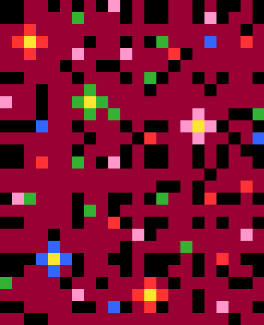

# ARC Task 642d658d (Pattern-only)

## Task at a glance

| Train 0 Input | Train 0 Output |
|---|---|
|  |  |

| Train 1 Input | Train 1 Output |
|---|---|
|  |  |

| Train 2 Input | Train 2 Output |
|---|---|
|  |  |

| Test 0 Input |
|---|
|  |

## Pattern overlays in action
- Mosaic view with all train and test examples across pattern kinds:
  - Columns: H3, V3, WINDOW (centerless n×m)
  - Each panel shows the input grid with overlay boxes on the left and a single-cell output on the right.


## Abstract
The `PatternOverlayExtractor` emits overlays for one kind: `window_nxm` (every full `n×m` window, centerless, each carrying its per-window schema). The `UniformPatternPredicate` reads evidence from the window’s center neighborhood (odd×odd: cross; even×even: central 2×2; odd×even: 1×2; even×odd: 2×1). Program search enumerates color parameters per window shape. In addition, universal fixed-schema pipelines are supported: for a chosen shape, we compute intersected universal schemas from train+test and match them everywhere with a single op, then aggregate matched values to predict the color.

## 1. Methods (pattern-only)

- `PatternOverlayExtractor(kind=..., color=c)` with kinds and detection rules:
  - `window_nxm` (centerless `n×m` windows): emits one overlay per full `n×m` window on the grid. Each overlay includes the raw window and a per-window equality schema.

- `UniformPatternPredicate` (kind-aware evidence → final color):
  - `window_nxm`: For each window, if the center neighborhood is uniform and non-zero, collect that color (odd×odd: cross; even×even: 2×2; odd×even: 1×2; even×odd: 2×1). Final prediction is the mode (tie → min). Degenerate shapes 1×3 and 3×1 behave like horizontal/vertical flank checks.

- Program schema (abstraction space):
```
PatternOverlayExtractor(kind=..., color=...) |> UniformPatternPredicate |> OutputAgreedColor
```

## 2. Enumeration spaces

- G core: composed color rules only (no pre-ops). Nodes = number of composed rules (currently 70; see repro output).
 - Abstraction: pattern kinds × colors (1–9). Nodes = 3 × 9 = 27.
 - Single-pass enumeration: ABS is enumerated once and includes all three `window_nxm` shape instantiations: `(1,3)`, `(3,1)`, and the default window.
 - Typed composition seeds: the operations that accept `GridState` are the chooser ops for G, the overlay extractors for ABS (`OpBrightOverlayIdentity(kind=window_nxm, window_shape∈{(1,3),(3,1),default}, color∈1..9)`), and universal fixed-schema matchers derived from train+test (one per shape), labeled as `match_universal_pos(shape=(h,w))`. Each universal matcher tries all positions for that shape (no per-position parameters). Aggregators then map matches to a color.

## 2.1 Operations and Types

G ops (core composition)

| Operation (label) | Input type | Output type | Description |
|---|---|---|---|
| `choose_cross_implied_33` | `GridState` | `CenterState` | Choose center color maximizing 3×3 cross-equality constraint. |
| `choose_best_flank` | `GridState` | `CenterState` | Choose center color maximizing flank-agreement hits. |
| `choose_best_cross` | `GridState` | `CenterState` | Choose center color maximizing uniform 4-neighborhood hits. |
| `out_cross_mode_33` | `CenterState` | `ColorState` | Output mode color from 3×3 cross around chosen centers. |
| `out_flank_mode` | `CenterState` | `ColorState` | Output mode flank color around chosen centers. |

Abstraction (A) ops

| Operation (label) | Input type | Output type | Notes |
|---|---|---|---|
| `overlay_window_nxm` | `GridState` | `OverlayContext` | Parameterized by `color ∈ {1..9}` and `window_shape ∈ {(1,3),(3,1),default}`. |
| `uniform_pattern_predicate` | `OverlayContext` | `ColorState` | Center-neighborhood evidence aggregation by shape parity. |
| `match_universal_pos(shape=(h,w))` | `GridState` | `MatchesState` | Matches all intersected universal schemas for the given shape across all positions (single op; no per-position parameters). |
| `uniform_color_from_matches` | `MatchesState` | `ColorState` | Aggregates non-None, non-zero values from matches and returns mode. Variants include per-schema mode and exclude-global.

These tables reflect the explicit op registries defined in `dsl.py` (`G_TYPED_OPS` and `A_OP_TYPE_SUMMARY`).

Removed/changed functionality
- The colorless detector `window_nxm_all` and overlay-based schema matching have been removed. Universal schemas are now computed by direct full-window enumeration and logical intersection (train+test), then used via a single-shape matcher `match_universal_pos(shape=...)` instead of per-position instantiations.

## 3. Results

- Programs found (abstraction):
  - `PatternOverlayExtractor(kind=window_nxm, color=c, window_shape=(1,3)) |> UniformPatternPredicate |> OutputAgreedColor`
  - `PatternOverlayExtractor(kind=window_nxm, color=c, window_shape=(3,1)) |> UniformPatternPredicate |> OutputAgreedColor`
  - `PatternOverlayExtractor(kind=window_nxm, color=c, window_shape=(n,m)) |> UniformPatternPredicate |> OutputAgreedColor`

- Node counts (this run):
  - G core: 70 (composition only)
  - Abstraction: 27

## Code layout

- `overlay_patterns.py`: overlay detector implementing `window_nxm` (supports `window_shape`; emits full windows with per-window schema).
- `pattern_mining.py`: generic 1×3 schema miner (used for exploratory analysis; not required for window_nxm detection).
- `dsl.py`: pipeline wiring, enumeration/printing of programs, universal schema intersection helpers, fixed-schema matcher, and predicate for `window_nxm`.

## 4. Window size semantics (`window_nxm`)

- `WINDOW_SHAPE_DEFAULT`: Global default `n` used by detection and printing; any `n ≥ 1`.
- Full-window requirement: Only full `n×m` windows entirely inside the grid are emitted for `window_nxm`.
- Odd vs even neighborhoods: odd `n` uses a four-way cross; even `n` uses the central 2×2.
- Edge cases: `n=1` yields no evidence; larger `n` reduces available windows on small grids.

## 5. Printed program schemas

For `window_nxm`, programs include `window_shape=n`. Each overlay already carries its per-window schema (`schema` field), so no global consensus string is printed.

## Reproducing

Requirements:
- Python 3.10+ with `numpy`

Run:
```bash
python3 repro.py
```

Artifacts:
- Image: `images/overlay_mosaic.png`
- Stats: `repro_stats.json` (node counts, programs, timing), `pattern_stats.json` (per-example overlay details)

Notes:
- Code is pattern-only.
- To include universal schema matchers for additional shapes in enumeration programmatically, call:
  ```python
  dsl.enumerate_programs_for_task(task, universal_shapes=[(1,3),(3,1),(3,3)])
  ```
  By default, `(1,3)`, `(3,1)`, and the current `WINDOW_SHAPE_DEFAULT` are included.
