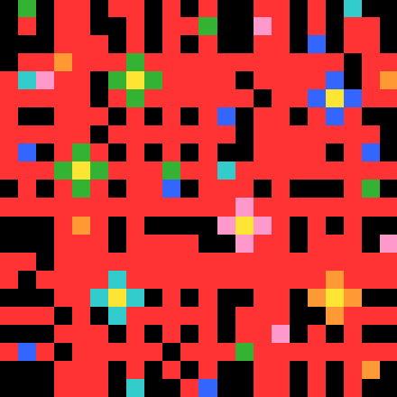
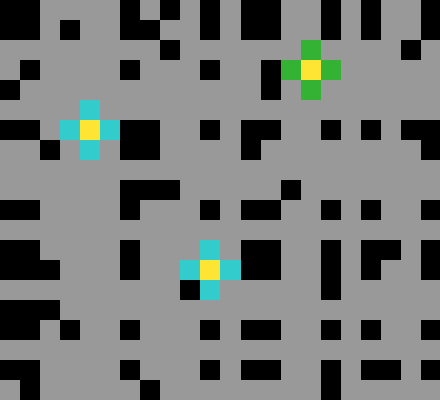

# ARC Task 642d658d (Pattern-only)

## Task at a glance

| Train 0 Input | Train 0 Output |
|---|---|
|  |  |

| Train 1 Input | Train 1 Output |
|---|---|
|  |  |

| Train 2 Input | Train 2 Output |
|---|---|
|  |  |

| Test 0 Input |
|---|
|  |

## Universal matcher mosaic
- Mosaic view with all train and test examples across universal matcher shapes:
  - Columns: 1×3, 3×1, WINDOW (3×3)
  - Each panel shows the input grid with yellow rectangles where `match_universal_pos(shape=...)` finds matches that are consistent with the uniform-neighborhood aggregator; the right panel shows the predicted color.


## Abstract
We use universal fixed-schema pipelines: for each shape, we compute intersected universal schemas from train+test and match them everywhere with a single op, then aggregate matched values to predict the color. The visualization shows only matches that would be retained by the aggregator (uniform neighborhood), avoiding pre-aggregation hits that get discarded later.

## 1. Methods (universal-only)

- `match_universal_pos(shape=(h,w))` matches all intersected universal schemas for the given shape across all positions (single op; no per-position parameters).
- Aggregators convert matches to a color: mode, per-schema mode, exclude-global, and uniform-neighborhood.

## 2. Enumeration spaces

- G core: composed color rules only (no pre-ops). Nodes = number of composed rules (currently 70; see repro output).
 - Abstraction: pattern kinds × colors (1–9). Nodes = 3 × 9 = 27.
 - Single-pass enumeration: ABS is enumerated once and includes universal fixed-schema matchers (one per shape among `(1,3)`, `(3,1)`, and the default window), labeled `match_universal_pos(shape=(h,w))`. Each universal matcher tries all positions for that shape (no per-position parameters). Aggregators then map matches to a color.

## 2.1 Operations and Types

G ops (core composition)

| Operation (label) | Input type | Output type | Description |
|---|---|---|---|
| `choose_cross_implied_33` | `GridState` | `CenterState` | Choose center color maximizing 3×3 cross-equality constraint. |
| `choose_best_flank` | `GridState` | `CenterState` | Choose center color maximizing flank-agreement hits. |
| `choose_best_cross` | `GridState` | `CenterState` | Choose center color maximizing uniform 4-neighborhood hits. |
| `out_cross_mode_33` | `CenterState` | `ColorState` | Output mode color from 3×3 cross around chosen centers. |
| `out_flank_mode` | `CenterState` | `ColorState` | Output mode flank color around chosen centers. |

Abstraction (A) ops

| Operation (label) | Input type | Output type | Notes |
|---|---|---|---|
| `match_universal_pos(shape=(h,w))` | `GridState` | `MatchesState` | Matches all intersected universal schemas for the given shape across all positions (single op; no per-position parameters). |
| `uniform_color_from_matches` | `MatchesState` | `ColorState` | Aggregates non-None, non-zero values from matches and returns mode. Variants include per-schema mode, exclude-global, and uniform-neighborhood.

These tables reflect the explicit op registries defined in `dsl.py` (`G_TYPED_OPS` and `A_OP_TYPE_SUMMARY`).

Removed/changed functionality
- Overlay-based `PatternOverlayExtractor` + `UniformPatternPredicate` programs have been removed from enumeration; the same functionality is handled by universal schema matchers with aggregators.

## 3. Results

- Programs found (abstraction):
  - `PatternOverlayExtractor(kind=window_nxm, color=c, window_shape=(1,3)) |> UniformPatternPredicate |> OutputAgreedColor`
  - `PatternOverlayExtractor(kind=window_nxm, color=c, window_shape=(3,1)) |> UniformPatternPredicate |> OutputAgreedColor`
  - `PatternOverlayExtractor(kind=window_nxm, color=c, window_shape=(n,m)) |> UniformPatternPredicate |> OutputAgreedColor`

- Node counts (this run):
  - G core: 70 (composition only)
  - Abstraction: 27

## Code layout

- `overlay_patterns.py`: legacy overlay detector; not used in universal-only runs.
- `pattern_mining.py`: generic 1×3 schema miner (used for exploratory analysis; not required for window_nxm detection).
- `dsl.py`: pipeline wiring, enumeration/printing of programs, universal schema intersection helpers, fixed-schema matcher, and predicate for `window_nxm`.

## 4. Aggregator neighborhood semantics

- Uniform-neighborhood aggregator uses shape-parity neighborhoods: odd×odd → cross; even×even → central 2×2; odd×even → 1×2; even×odd → 2×1. 1×3 and 3×1 reduce to flank checks.

## 5. Printed program schemas

For `window_nxm`, programs include `window_shape=n`. Each overlay already carries its per-window schema (`schema` field), so no global consensus string is printed.

## Reproducing

Requirements:
- Python 3.10+ with `numpy`

Run:
```bash
python3 repro.py
```

Artifacts:
- Image: `images/overlay_mosaic.png`
- Stats: `repro_stats.json` (node counts, programs, timing), `pattern_stats.json` (per-example overlay details)

Notes:
- Code is pattern-only.
 - To include universal schema matchers for specific shapes in enumeration, pass them explicitly:
  ```python
  dsl.enumerate_programs_for_task(task, universal_shapes=[(1,3),(3,1),(3,3)])
  ```
